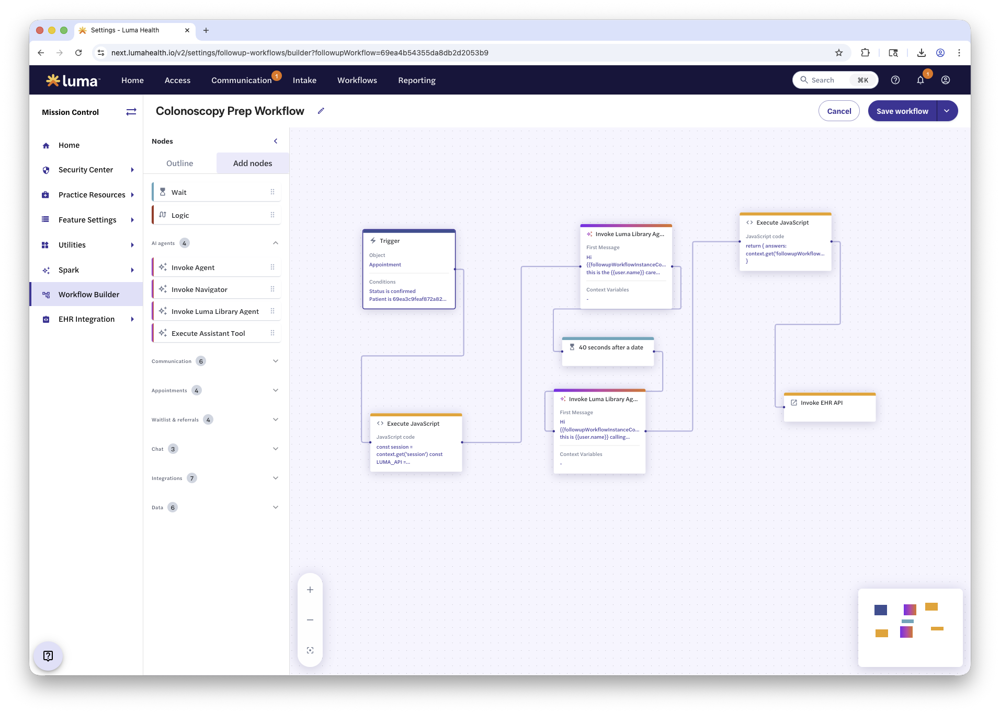

# Open-Source Colonoscopy Prep Playbook

An open-source pre-visit coordination workflow for GI service lines, released by [Luma Health](https://lumahealth.io). Designed to reduce no-shows and improve patient preparation compliance through automated, Epic-integrated outreach.

**License:** Apache 2.0 — [go.lumahealth.io/colonoscopy-workflow](https://go.lumahealth.io/colonoscopy-workflow)

---

## What's in this repo

| File | Description |
|------|-------------|
| `colonoscopy-prep-workflow.png` | Diagram illustrating the end-to-end prep workflow |
| `colonoscopy-prep-workflow.json` | Workflow definition for the colonoscopy prep process |
| `colonoscopy-prep-workflow-steps.json` | Step-by-step configuration for the prep workflow |
| `epic-colonoscopy-extract-sample.xlsx` / [`.md`](epic-colonoscopy-extract-sample.md) | Sample Epic Reporting Workbench report showing the fields and structure used to drive the prep workflow (all *fake* data) |
| `epic-colonoscopy-prep-ai-system-card.docx` / [`.md`](epic-colonoscopy-prep-ai-system-card.md) | AI system card documenting the design, scope, limitations, and compliance guidelines for the AI voice agent used in prep outreach |

---

## Overview

This playbook orchestrates end-to-end pre-visit colonoscopy prep workflows within Epic:

1. **Procedure scheduling** — pulls order and protocol data from Epic
2. **Outbound voice agent calls** — confirms prep details with patients via AI-driven phone calls
3. **Chart integration** — writes discrete data back into the Epic record
4. **Automated escalation** — flags missing or incomplete information for staff follow-up
5. **Outcomes** — improved adequate-prep rates and reduced day-of cancellations

The workflow runs fully inside Epic rather than as a standalone phone system. Patient data is never used to train AI models.

---

## Getting started

This playbook is available with **90 days of free service** and a **15-day go-live** timeline for eligible Epic sites.

To get started or confirm eligibility:

- Book a 30-minute call: [go.lumahealth.io/colonoscopy-workflow](https://go.lumahealth.io/colonoscopy-workflow)
- Email: openprep@lumahealth.io

---

## License

Licensed under the [Apache License, Version 2.0](LICENSE).
